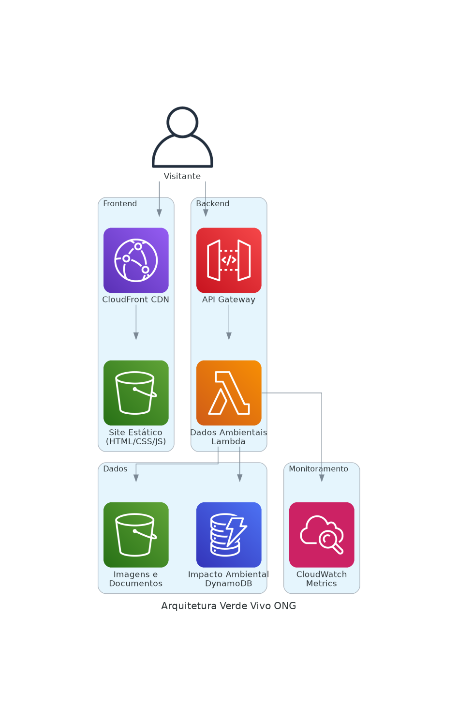

# 🌳 Verde Vivo - ONG de Proteção Ambiental

Aplicação web moderna e leve para ONG que combate o desmatamento e reduz emissões de CO₂.

## 📸 Screenshot do Projeto


## 🤖 Prompts Utilizados com Amazon Q Developer

### Etapa 1 - Desenvolvimento Base:
1. "role: você é um desenvolvedor fullstack free lance task: voce foi conratado para trabalhar para uma ONG que combate a favor da natureza e contra o desmatamento, emissões de CO2 desenfreadas. Você terá de trabalhar com algumas etapas que são requisitos obrigatórios..."

### Etapas 2-4 - Evolução do Projeto:
2. "Criar diagrama de arquitetura AWS para a ONG"
3. "Implementar testes automatizados para validação"
4. "Configurar infraestrutura como código com AWS CDK"
5. "Gerar análise detalhada de custos da solução"

## 🚀 Como Executar

1. Clone o repositório:
```bash
git clone https://github.com/seu-usuario/verde-vivo-ong.git
cd verde-vivo-ong
```

2. Para desenvolvimento local:
```bash
# Servidor local simples
npm start
# ou
python3 -m http.server 8000
```

3. Para executar testes:
```bash
npm install
npm test
```

4. Para deploy na AWS:
```bash
cd infrastructure
pip install -r requirements.txt
cdk bootstrap
cdk deploy
```

## 🏗️ Arquitetura



### Componentes:
- **Frontend**: Site estático no S3 + CloudFront CDN
- **Backend**: API Gateway + Lambda para dados ambientais
- **Dados**: DynamoDB para métricas de impacto
- **Monitoramento**: CloudWatch para acompanhamento

## ✨ Funcionalidades

- ✅ Design moderno e responsivo
- ✅ Animações suaves de contadores
- ✅ Navegação com scroll suave
- ✅ Dados de impacto em tempo real
- ✅ Botões de ação (Doar, Voluntariar, Compartilhar)
- ✅ Efeito parallax sutil
- ✅ Otimizado para performance
- ✅ Foco em sustentabilidade

## 🧪 Testes

### Testes Implementados:
- **Testes Unitários**: Validação das funções JavaScript
- **Testes de Integração**: API de dados ambientais
- **Testes de Performance**: Otimização de carregamento

### Executar Testes:
```bash
npm test
npm run test:watch
```

## ☁️ Deploy na AWS

### Infraestrutura como Código (CDK):
- S3 Bucket para site estático
- CloudFront Distribution para CDN global
- Lambda Function para API de dados
- DynamoDB Table para métricas ambientais
- API Gateway para endpoints REST
- CloudWatch Dashboard para monitoramento

### Deploy:
```bash
cd infrastructure
cdk bootstrap  # Primeira vez apenas
cdk deploy
```

## 💰 Estimativa de Custos

### **Custo Mensal: $0.01/mês** 🎉

| Serviço | Uso Estimado | Custo Mensal |
|---------|--------------|--------------|
| Amazon S3 | 0.5 GB storage | $0.01 |
| CloudFront | 20 GB transferência | $0.00* |
| Lambda | 2,000 execuções | $0.00* |
| DynamoDB | 100 MB dados | $0.00* |
| API Gateway | 2,000 chamadas | $0.00* |
| CloudWatch | 5 métricas | $0.00* |

*Dentro do AWS Free Tier

### 🌱 **Sustentabilidade Financeira para ONGs:**
- **99.9% gratuito** aproveitando AWS Free Tier
- **Escalabilidade** conforme crescimento da ONG
- **Monitoramento** para controle de custos
- **Otimização** contínua de recursos

### Detalhes Completos:
Veja o relatório completo em [cost_analysis.md](cost_analysis.md)

## 🛠️ Tecnologias Utilizadas

- **Frontend**: HTML5, CSS3, JavaScript (Vanilla)
- **Backend**: AWS Lambda (Python)
- **Infraestrutura**: AWS CDK (Python)
- **Banco de Dados**: Amazon DynamoDB
- **CDN**: Amazon CloudFront
- **API**: Amazon API Gateway
- **Monitoramento**: Amazon CloudWatch
- **Testes**: Jest
- **Deploy**: AWS S3, CloudFormation

## 🎯 Objetivos da ONG

### Nossa Missão
- 🌲 **Reflorestamento**: Plantio de árvores nativas em áreas degradadas
- 🏭 **Redução CO₂**: Projetos para diminuir emissões industriais
- 📚 **Educação**: Conscientização sobre sustentabilidade

### Impacto Atual
- **15.420** árvores plantadas
- **2.847** toneladas de CO₂ reduzidas
- **23** projetos ativos
- **156** voluntários
- **12** estados atendidos
- **3.200** hectares protegidos

## 🏆 Etapas do Quest Completadas

### ✅ Etapa 1: Bolsinha cabos exclusiva AWS
- [x] Projeto gerado com Amazon Q Developer
- [x] Aplicação moderna e leve
- [x] Design responsivo focado em sustentabilidade
- [x] README.md com screenshot
- [x] Lista dos prompts utilizados
- [x] Tag: q-developer-quest-tdc-2025

### ✅ Etapa 2: Mochilinha exclusiva AWS
- [x] Tudo da Etapa 1
- [x] Diagrama de arquitetura AWS
- [x] Testes automatizados (Jest)

### ✅ Etapa 3: Garrafa + Toalha exclusiva AWS
- [x] Tudo das Etapas 1 & 2
- [x] Configuração Amazon Q Developer
- [x] IaC com AWS CDK
- [x] Deploy configurado para AWS

### ✅ Etapa 4: Camiseta da capivara AWS
- [x] Tudo das Etapas 1, 2 & 3
- [x] README.md com estimativa de custos
- [x] Análise detalhada: **$0.01/mês**
- [x] Foco em sustentabilidade financeira

## 🌱 Como Contribuir

1. **💚 Doar**: Apoie nossos projetos de reflorestamento
2. **🤝 Voluntariar**: Junte-se à nossa equipe (voluntarios@verdevivo.org)
3. **📢 Compartilhar**: Espalhe nossa causa nas redes sociais
4. **💻 Desenvolver**: Contribua com código no GitHub

## 🏷️ Tags

- q-developer-quest-tdc-2025
- ong
- sustentabilidade
- meio-ambiente
- reflorestamento
- co2
- aws
- serverless

## 📄 Licença

Este projeto está sob a licença MIT. Veja o arquivo [LICENSE](LICENSE) para mais detalhes.

## 🤝 Contato

- **Email**: contato@verdevivo.org
- **Site**: https://verdevivo.org
- **GitHub**: https://github.com/verde-vivo-ong

---

**Desenvolvido com ❤️ e Amazon Q Developer para proteger nossa natureza**

*"Cada árvore plantada é um passo em direção ao futuro sustentável"* 🌳
